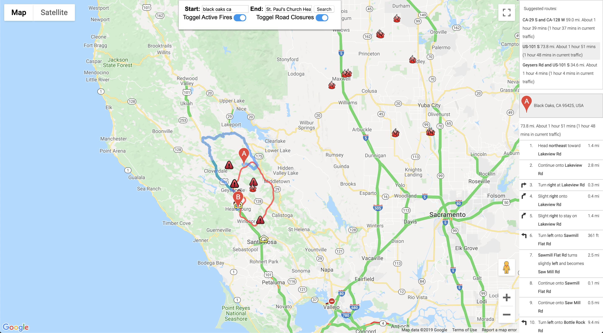

# Optimizing Evacuation Routes: Identifying the Fastest route in Real Time (Kincade Fire CA)

<em>By: Wilson Stewart, Alaa Senjab & Djuwita Carney</em>

During emergency situations, time is the key. Identifying the fastest route to safety or any other related emergency destinations such as hospitals, warming centers shelters, etc. becomes very important during these situations. 

In this project, we developed a tool that shows the fastest route between two locations under the real time traffic condition.


The deliverable of this project inludes"

-   The mapping tool
-   A set of Jupyter notebooks and executable scripts that output the fastest possible route under the real time traffic condition.
-   Dataset collected from several goverment sites
-   Datasets collected from twitter using twitter's api
-   [Google Slides Presentation](https://docs.google.com/presentation/d/17n2EbAjLC2QRx3Zfs5boPi6oWmr5oVD6SUpZ5uYk1C0/edit?usp=sharing)


## Methodology

Our main focus was determining the fastest and safest evacuation routes during the Kincade Fire in Sonoma CA. 

**Data Collection** 

Although this tool is applicable to any situations, for this project we used Sonoma County, CA wildfire incidents.  Using the on going incidents allows us to use the real time traffic situation. the location of wildfire incidents were downloaded from:

- [Real time wildfire incidents accross the US](https://firms.modaps.eosdis.nasa.gov/active_fire/#firms-txt)
- [Real time wildfire incidents in Sonoma County CA](https://fire.ca.gov/incidents/)
- [Active shelters in Sonoma County, CA](https://socoemergency.org/shelters-and-warming-centers/)
- [Map of the real time situation around the wildfire area](https://sonomacounty.maps.arcgis.com/apps/webappviewer/index.html?id=2cb4401e1fc0494dbf9d9e22aa794617)
- [Map of evacuation routes in Sonoma County](https://www.pressdemocrat.com/news/10124814-181/santa-rosa-releases-evacuation-maps?artslide=4)

We also collected live twitter data using tweepy and GetOldTweets3:
- [tweepy](https://www.tweepy.org/)
- [GetOldTweets3](https://pypi.org/project/GetOldTweets3/)

We used the Google Maps API to build an app for real-time mapping:
- [Google Maps API](https://developers.google.com/maps/documentation)


## Modeling and Predictions

We attempted to use live twitter data to determine road closures/statuses in real-time. We gathered tweets from the last year in Sonoma County using the `GetOldTweets3` library from all relevant traffic twitter accounts. Next, we used keywords to determine which tweets were discussing topics related to road closures or slowdowns. After we classified our tweets as either discussing closures or not we were then able to build a Logistic Regression model to use in our prediction process. Our Logistic Regression Model had an accuracy score of about 93% on the year-long data-set which was a large improvement over the baseline score of about 77%, therefore our model seemed to perform reasonably well.
<br>
<br>
After building our Logisitic Regression model we then gathered live twitter data during the Kincade Fire in Sonoma County CA. We used our Logistic Regression model to make predictions on this new (unseen) data about whether or not the tweet was discussing road closures. In order to validate the correctness of this model someone would have to manually check the county road closures to see if they match up with what the tweets in our predictions say. This was beyond the scope of this project, however, using our model would allow for a faster checking process.


## Mapping Application

Using GoogleMaps API we built an application that takes in real-time data and allows a user to figure out the best route to travel between any 2 points. Since we focused on the Kincade Fire in CA we used government data to map the effective size of the fire, the current road closures, and the current evacuation centers. This can be done in theory for any natural disaster, but would not be possible with such a small team because disasters change so rapidly. A user can also see all fires currently active in North America using a map filter. The shelters are pinned endpoint locations on our map, which makes it an easy tool for someone trying to make it safely to one of the evacuation centers.

### Results:

—  


### Installation:

To run this app do the following:

1. Fork/clone this repo


2. A good practice is to create an environment:
        ```python3 -m venv env```


3. Activate the  environment:
        ```source env/bin/activate```


4. Install  the dependencies:
        ```pip install -r requirements.txt```


5. Google API key ([Get yours](https://developers.google.com/maps/documentation)):
    - Edit the app.py file
        ```vim app.py```
    - Navigate to `google_api` variable and add your key
    
6. Excute your app.py:
    ```python app.py```


7. Navigate to http://127.0.0.1:8000/


## Conclusion: Recommendations, and Future Improvements

#### Recommendations:

In our project we were able to pretty effectively determine what roads were closed and what roads were open based on our model derived from historical twitter data. However, because determining road closures in real time is an incredibly difficult process we might want to look at additional resources in the future in to further inform our model. Often times traffic models during natural disasters require [a team of people working on the ground](https://www.citylab.com/transportation/2018/09/after-the-storm-a-flood-of-data/570640/). We clearly did not have a large team nor did we have the resources to go into the field so we were limited by our model building process. There are other modeling techniques we could have taken too if we had more time and resources. Using our model and application it is recommended that a user looks at the tweets flagged as road closures and tries to avoid these roads on their specific evacuation route. Our applications also displays resources that will help in an evacuation process such as real-time traffic information provided by Google, and road closures listed on the County's website.
<br>
<br>

#### Future Improvements

The most rigorous, but comprehensive way to solve this problem would be to tackle the maximum flow problem. The maximum flow problem looks at a route and finds a feasible path (or flow) from one point in the route to another. Here is an example of how this problem is typically visualized: <br>

Basically, as routes change or we become restricted to just one direction (think tree falling down in a storm or a road flooding) this model can find the fastest route between (in this particular image) points 1 and 5. Let's take as another example this graph: <br> 

Here we see clearly the only route to take between points s and t. A lot of the time in natural disasters there is only one route to take that is dynamically changing, which lends itself nicely to this type of problem. 

Another challenge we ran into on this project was the access we got through using free API versions was not as comprehensive as we would need if we really wanted to help most effectively during a natural disaster. It would be mandatory for people to use paid versions of APIs to best help the communities, or companies could partner with disaster agencies to lift API fees during natural disasters. 


